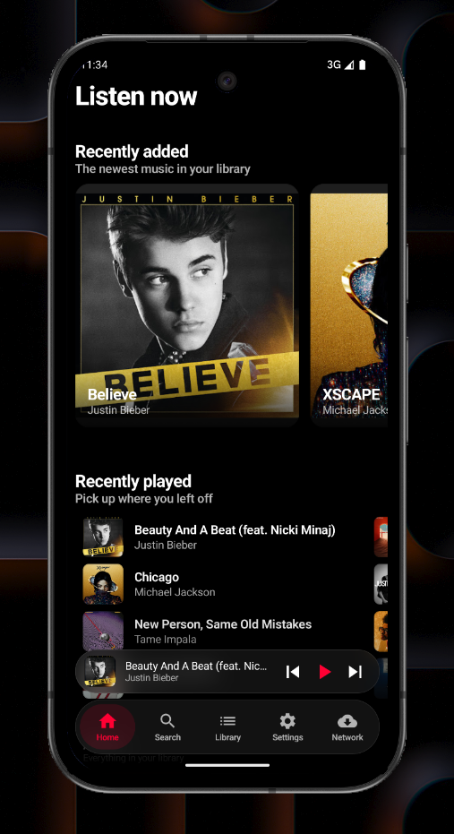
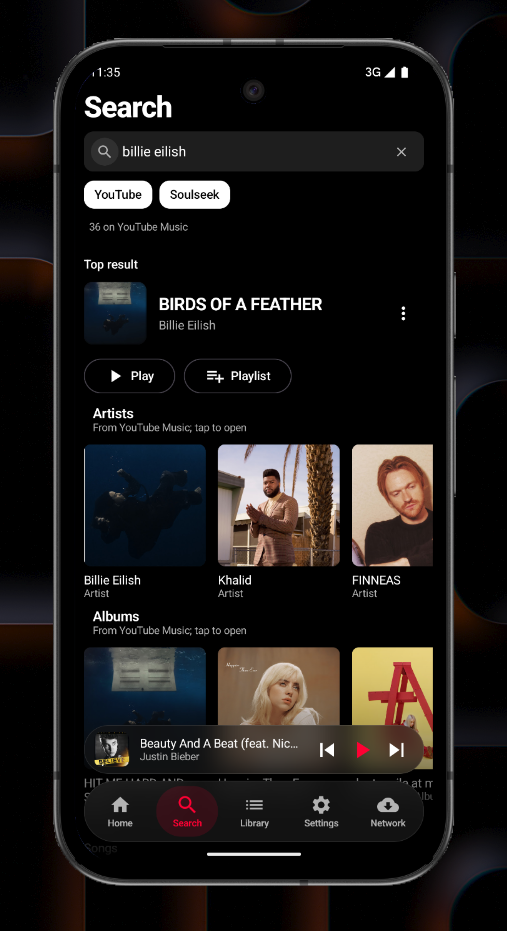
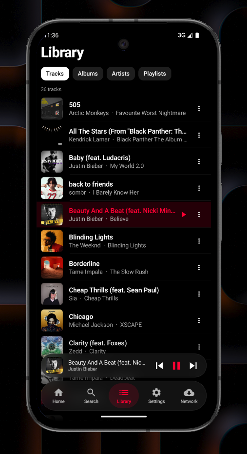
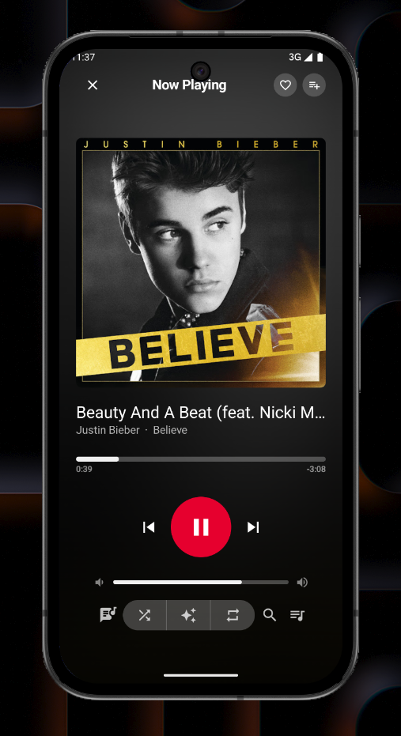
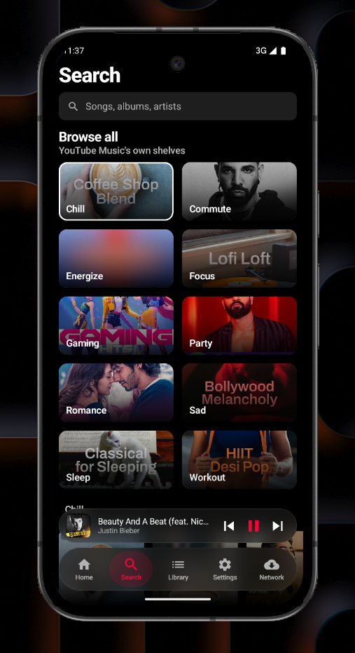
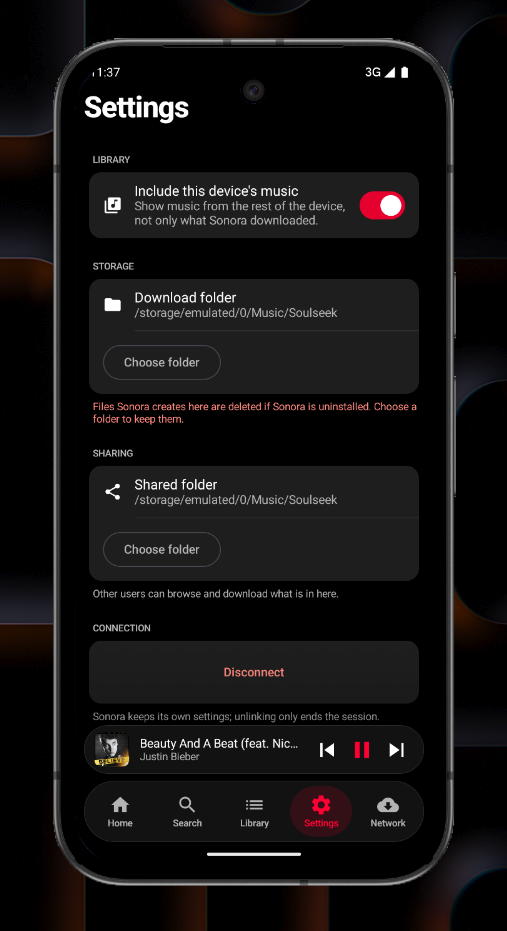
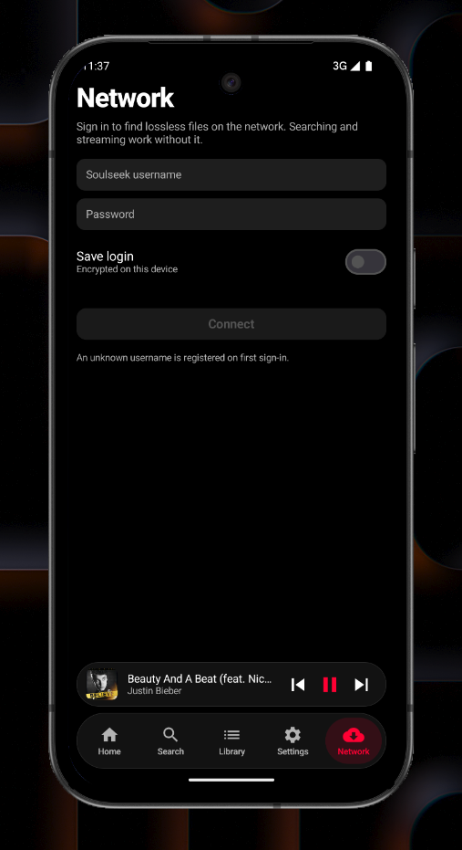

# Sonora

A native Android music client that speaks Soulseek itself and browses YouTube Music. Stream from
YouTube Music or find a lossless copy on the peer network, keep a library of both, and play it — with
the P2P protocol running on the phone. No server, no VPS, no self-hosting.

**[Download the latest release →](https://github.com/devansharora18/sonora/releases)**

| Home | Search | Library |
| :---: | :---: | :---: |
|  |  |  |

| Player | Browse | Settings |
| :---: | :---: | :---: |
|  |  |  |

<!-- | Network |
| :---: |
|  | -->

## Install

Download the APK from [Releases](https://github.com/devansharora18/sonora/releases) and open it on
your phone. Android will ask you to allow installing from that source the first time.

Searching and streaming need no account at all. You only need a Soulseek username to search the
peer network, and Sonora registers an unknown one on first sign-in. Requires Android 8.0 (API 26) or
newer.

## What it does

**Two sources, and it is clear which is which.** YouTube Music is the catalogue and the thing you
play from: search it, open albums and artists, browse its own shelves. The Soulseek network is where
lossless files are: a track's "get me a lossless copy" searches peers and nothing else, because
that answer has to be a real file on somebody's disk and a YouTube row is not one.

**The protocol runs on the device.** Sonora speaks Soulseek itself — login, search, peer
connections, transfers, uploads — in Kotlin, inside a foreground service. There is no relay and no
companion process; the app is the client.

**The filesystem is the library.** Downloads go to a folder you choose, so the files are yours and
survive uninstalling the app. Anything that is only streamed is kept with its own details, so a
playlist entry, a like or a line of listening history can still be drawn, played and shown — which is
what stops a liked song from failing to appear in Liked Songs.

- **Search** — top result, then artists, albums and songs from YouTube Music, with a toggle to look
  at the peer network on its own for something lossless. Relevance-ranked, with size, bitrate, peer
  and free-slot signals; sort by best match, fastest, free slot or quality.
- **Streaming** — YouTube Music audio straight to the player, read in bounded ranges and verified
  past the first megabyte before it is handed over, so a track cannot start and then die a minute in.
- **Downloads** — a sequential queue with live progress, cancel-remaining, and a notification that
  says what is actually happening.
- **Library** — tracks, albums, artists and playlists, plus the music already on your device if you
  want it included. A playlist's cover is a grid of the covers of the tracks in it.
- **Playback** — Media3, with a mini player, a full player, a queue you can reorder by dragging,
  shuffle, repeat, and a real media notification with the cover and transport controls.
- **Lyrics** — time-synced, with the sung part swept across the line, the surrounding lines falling
  away, and a tap to browse them instead of following.
- **Infinite autoplay** — the queue does not run out; when it gets near the end it tops itself up
  from the artist you are listening to, and keeps going.
- **On-device taste** — it learns what you finish, skip, like and what plays after what, and keeps
  that model on the phone. Autoplay refills from it and from YouTube Music's radio, preferring a
  lossless copy you already have. Export or import it, or erase it, from Settings → Taste.
- **Spotify import** — paste a playlist link, see what matched and what did not before anything is
  added, and get the tracks as streams rather than as downloads.
- **Resharing** — the folder you download to is shared back, with browsing and uploads working.
- **Saved login** — optional, and encrypted with a key held in the Android Keystore.

## Build

You need JDK 21 and the Android SDK with platform 37. Android Studio's bundled JDK is fine:

```bash
export JAVA_HOME="$HOME/development/android-studio/jbr"
./gradlew :app:assembleDebug        # debug APK
./gradlew :app:testDebugUnitTest    # unit tests — no device or emulator needed
./gradlew :app:assembleRelease      # release APK
```

A release build is signed from `keystore.properties` at the repository root, which is deliberately
not committed:

```properties
storeFile=sonora-release.jks
storePassword=…
keyAlias=sonora
keyPassword=…
```

Without that file the release build still runs and produces an unsigned APK. See
[toolchain](docs/toolchain.md) for the version pairing and the four traps that produced it.


## License

AGPL-3.0. See [LICENSE](LICENSE).

This is a file-sharing client, not a content host. You are responsible for what you download and
share.
